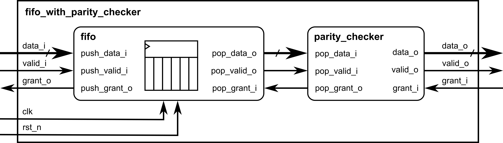

# FIFO with Parity Checker
This project implements a small logic block composed of a synchronous first-in, first-out (FIFO) memory and a parity checker. A block diagram of the system is shown below. The incoming data is first stored in the FIFO memory. The data read from the FIFO is then checked by the parity checker before being forwarded to the output channel. 


## Repository Structure
This repository contains the following directories. 
```
.
├── doc         # documentation
├── final       # post-PNR gate-level netlist (*.pnl.v) and SDF (*.sdf)
├── lib         # SkyWater 130nm PDK Verilog models
├── librelane   # LibreLane config and output
├── rtl         # RTL sources files (.v and .vh)
├── scripts     # flow scripts
└── sim         # testbenches
```
## Usage
The following Makefile targets are available. 
```bash
make sim        # perform RTL simulation in Icarus Verilog
make wave       # view RTL waveform in GTKWave
make pnr        # run PNR in LibreLane
make pls        # run post-layout simulation in CVC
make wave_pls   # view PLS waveform in GTKWave
make clean      # remove build artifacts
```

## Dependencies
This project runs inside [IIC-OSIC-TOOLS](https://github.com/iic-jku/iic-osic-tools), a unified,
containerized environment for open-source IC design tools maintained by Johannes Kepler University. You may refer to the repository for setup instructions. 